# AVR_ATmega16
Here, you will find interfacing of various kind of sensors with ATmega16. I am using Microchip Studio for programming and Proteus software for simulating the circuits.

<h2><strong>INTRODUCTION TO AVR PROGRAMMING WITH PROTEUS</strong></h2>
  

  

  
<h4>P1: INTERFACING LED WITH
ATMEGA16</h4>

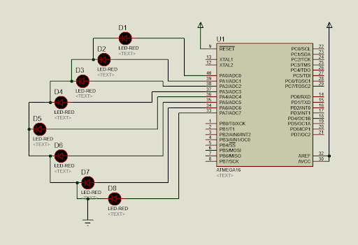

Code in Microchip Studio:

<pre
class="prettyprint">/*
 * P1_LedBlink.c
 *
 * Created: 12-03-2021 10:37:34
 * Author: Jervis
 */
#define F_CPU 1000000UL
#include &lt;avr/io.h>
#include &lt;util/delay.h>

int main(void)
{

DDRA = 0b00000000;

// Write your code here
	while (1)

{
		PORTA = 0b11110000;
		_delay_ms(1000);

PORTA = 0b00001111;
		_delay_ms(1000);

}
}</pre>
<h4>P2: INTERFACING SINGLE SEVEN
SEGMENT WITH ATMEGA16</h4>

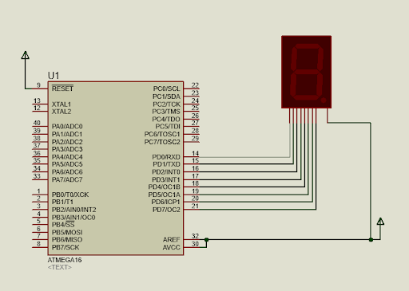

Code in Microchip Studio:

<pre
class="prettyprint">/*
 * P2_Single_Seven_Segment.c
 *
 * Created: 12-03-2021 11:00:09
 * Author : Jervis
 */ 
#define F_CPU 1000000UL
#include &lt;avr/io.h>
#include &lt;util/delay.h>
#define Direction_led DDRD
#define Port_led PORTD

int main(void)
{

Direction_led |= 0xff;
	Port_led |= 0xff;

int n[10]={0xC0,0xF9,0xA4,0xB0,0x99,0x92,0x82,0xF8,0x80,0x90};

unsigned int i;
    /* Replace with your application code */
    while (1) 
    {

	for(i=0; i&lt;10; i++ ){

Port_led = n[i];
			_delay_ms(1000);

}
    }
}</pre>
<h4>P3: INTERFACING DOUBLE SEVEN
SEGMENT WITH ATMEGA16</h4>

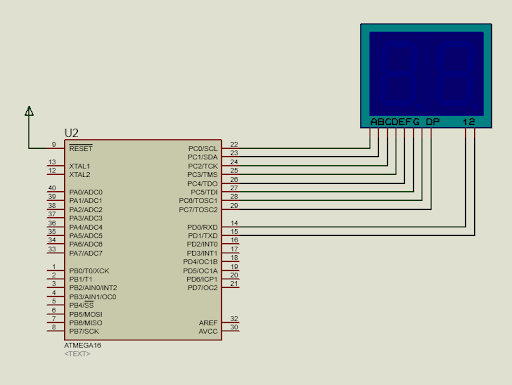

Code in Microchip Studio:

<pre
class="prettyprint">/*
 * P3_Double_Seven_Segment.c
 *
 * Created: 12-03-2021 11:21:05
 * Author : Jervis
 */ 

#define F_CPU 1000000UL
#include &lt;avr/io.h>
#include &lt;util/delay.h>
#define Direction_led DDRD
#define Direction_led2 DDRC
#define Port_led PORTD
#define Port_led2 PORTC

int main(void)
{

Direction_led = Direction_led2 = 0xff;

int n[10]={0xC0,0xF9,0xA4,0xB0,0x99,0x92,0x82,0xF8,0x80,0x90};

unsigned int i,j,p;

    while (1) 
    {

	for(j=0; j&lt;=5;j++){

for(i=0; i&lt;=9; i++ ){

for(p=1; p&lt;=48; p++){

Port_led = 0x01;
					Port_led2 = n[j];

_delay_ms(5);
					Port_led = 0x02;

Port_led2 = n[i];
					_delay_ms(5);
				}

}
		}
    }
}</pre>
<h4>P4: INTERFACING FOUR SEVEN SEGMENT
WITH ATMEGA16</h4>

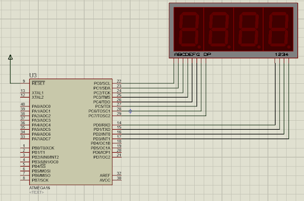

Code in Microchip Studio:

<pre
class="prettyprint">#include &lt;avr/io.h>
#include &lt;util/delay.h>

int main(void)
{

DDRC = DDRD = 0xff;
	

int a[10] = {0x3f,0x06,0x5b,0x4f,0x66,0x6d,0x7d,0x07,0x7f,0x6f};

	while(1)
	{

for (int l =0; l&lt;=9;l++)
		{

for (int k = 0;k&lt;=9;k++)
			{

for (int j =0; j&lt;=9;j++)
				{

for (int i =0; i&lt;=9;i++)
					{

						for (int p =1; p&lt;=25;p++)

{
							
							PORTD = 0b00001110;

PORTC = a[l]; _delay_ms(10);
							

PORTD = 0b00001101;

PORTC = a[k]; _delay_ms(10);
							

PORTD = 0b00001011;

PORTC = a[j]; _delay_ms(10);
							

PORTD = 0b00000111;

PORTC = a[i]; _delay_ms(10);
							

}
					}
				}
			}
		}

}
}</pre>
<h4>P5: INTERFACING FOUR SEVEN SEGMENT
WITH ATMEGA16</h4>

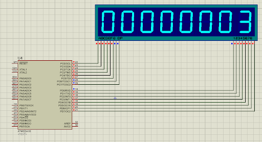

Code in Microchip Studio:

<pre
class="prettyprint">/*
 * P5_Eight_Seven_Segment.c
 *
 * Created: 13-03-2021 14:19:37
 * Author : Jervis
 */ 
#define F_CPU 1000000UL
#include &lt;avr/io.h>
#include &lt;util/delay.h>
#define DC DDRC
#define DD DDRD
#define PC PORTC
#define PD PORTD

int main(void)
{

	DC = DD = 0xff;

    int a[10] = {0x3f,0x06,0x5b,0x4f,0x66,0x6d,0x7d,0x07,0x7f,0x6f};

unsigned int i,j,k,l,m,n,o,p,r;

    while (1) 
    {

	for (i=0;i&lt;10;i++)
		{

for (j=0;j&lt;10;j++)
			{

for (k=0;k&lt;10;k++)
				{

for (l=0;l&lt;10;l++)
					{

for (m=0;m&lt;10;m++)
						{

for (n=0;n&lt;10;n++)
							{

for (o=0;o&lt;10;o++)
								{

for (p=0;p&lt;10;p++)
									{

for (r=1;r&lt;=48;r++)
								{

PORTD = 0b11111110;

PORTC = a[i]; _delay_ms(2);

PORTD = 0b11111101;

PORTC = a[j]; _delay_ms(2);
											

PORTD = 0b11111011;

PORTC = a[k]; _delay_ms(2);
											

PORTD = 0b11110111;

PORTC = a[l]; _delay_ms(2);
											

PORTD = 0b11101111;

             PORTC = a[m]; _delay_ms(2);

										
				PORTD = 0b11011111;

             PORTC = a[n]; _delay_ms(2);

										
					PORTD = 0b10111111;

             PORTC = a[o]; _delay_ms(2);

										
					PORTD = 0b01111111;

PORTC = a[p]; _delay_ms(2);
										}

}
								}
							}
						}
					}

}
			}
		}	
    }
}</pre>
<h4>P6: INTERFACING OF KEYPAD AND TWO
SEVEN SEGMENT WITH ATMEGA16</h4>

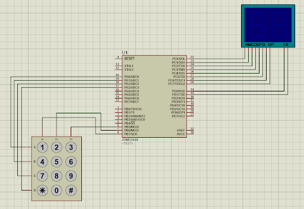

<pre
class="prettyprint">/*
 * P6_Keypad_Two_Seven_Segment.c
 *
 * Created: 13-03-2021 14:19:37
 * Author : Jervis
 */ 
#define F_CPU 1000000UL
#include &lt;avr/io.h>
#include &lt;util/delay.h>
#define DC DDRC
#define DD DDRD
#define PC PORTC
#define PD PORTD
int key()
{

while (1) {

PORTB = 0b01111111; _delay_ms(20);
		

if (PINA == 0xfe) { while (PINA == 0xfe); return  1;}

	

if (PINA == 0xfd) { while (PINA == 0xfd); return  4;}

	

if (PINA == 0xfb) { while (PINA == 0xfb); return  7;}

	

if (PINA == 0xf7) { while (PINA == 0xf7); return 10;}

	
		PORTB = 0b10111111; _delay_ms(20);

if (PINA == 0xfe) { while (PINA == 0xfe); return  2;}

	

if (PINA== 0xfd) { while (PINA == 0xfd); return  5;}

	

if (PINA == 0xfb) { while (PINA == 0xfb); return  8;}

	

if (PINA == 0xf7) { while (PINA == 0xf7); return 11;}

	
		PORTB = 0b11011111; _delay_ms(30);

if (PINA == 0xfe) { while (PINA == 0xfe); return  3;}

	

if (PINA == 0xfd) { while (PINA == 0xfd); return  6;}

	

if (PINA == 0xfb) { while (PINA == 0xfb); return  9;}

	

if (PINA == 0xf7) { while (PINA == 0xf7); return 12;}

} }

int main(void)
{	

DC = DD =DDRB = 0xff;

DDRA = 0xf0; PORTA = 0xff;
    int a[10] = {0x3f,0x06,0x5b,0x4f,0x66,0x6d,0x7d,0x07,0x7f,0x6f};

    while (1) 
    {

	int num = key();
		if (num&lt;10)

{ 
			PD = 0b11111110;

PC = a[num];_delay_ms(10);
		}

    }
}</pre>
<h4>P7: INTERFACING OF LCD 16*2
(4bitMode) WITH ATMEGA16</h4>

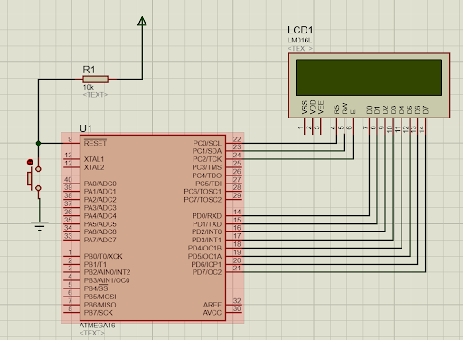

<pre
class="prettyprint">/*
 * P7_LCD_4bit.c
 *
 * Created: 14-03-2021 10:01:19
 * Author : Jervis
 */ 
#define F_CPU 1000000UL
#include &lt;avr/io.h>
#include &lt;string.h>
#include &lt;util/delay.h>

lcd_init()
{

lcd_cmd(0x02);
	lcd_cmd(0x38);

lcd_cmd(0x0c);
}
lcd_cmd(int x)
{

PORTD = x;
	PORTC = 0x04;

_delay_ms(2);

PORTC = 0x00;
}
lcd_data(int y)
{

PORTD = y;
	PORTC = 0x05;

_delay_ms(2);

PORTC = 0x01;
}
string_data(char *str){

int i = 0;

for(i=0; i&lt;=strlen(str) ; i++){

lcd_data(str[i]);
		_delay_ms(8);
		lcd_cmd(0x06);

}
}
char arr[11] = "0123456789";
number_data(int number){

int i;
	 if(number>0)
	 {

 i=number%10;
		 number=number/10;
		 

 number_data(number);
		 lcd_data(arr[i]);

 lcd_cmd(0x06);
		 _delay_ms(10);

 }
}
int main()
{

DDRC = DDRD = 0xff;
	lcd_init();

lcd_cmd(0x80);
	string_data("joy");
	_delay_ms(1000);

lcd_cmd(0xC0);
	number_data(9999);
_delay_ms(8);
}</pre>
<h4>P8: INTERFACING OF CALCULATOR
KEYPAD AND LCD 16*2 (4bitMode) WITH ATMEGA16</h4>

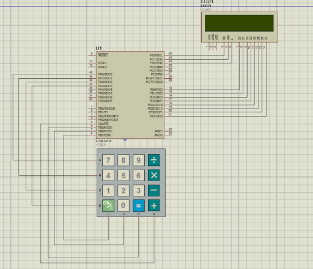

<pre
class="prettyprint">/*
 * P8_KeyPad_LCD_4bitMode.c
 *
 * Created: 14-03-2021 22:47:25
 * Author : Jervis
 */ 

#define F_CPU 1000000UL
#include &lt;avr/io.h>
#include &lt;string.h>
#include &lt;util/delay.h>

lcd_init()
{

lcd_cmd(0x02);
	lcd_cmd(0x38);

lcd_cmd(0x0c);
}

lcd_cmd(int x)
{

PORTD = x;
	PORTC = 0x04;

_delay_ms(2);

PORTC = 0x00;
}

lcd_data(int y)
{

PORTD = y;
	PORTC = 0x05;

_delay_ms(2);

PORTC = 0x01;
}

string_data(char *str){

int i = 0;

for(i=0; i&lt;=strlen(str) ; i++){

lcd_data(str[i]);
		_delay_ms(8);
		lcd_cmd(0x06);

}
}

number_data(int number){

char arr[11] = "0123456789";
	int i;

 if(number>0)
	 {
		 i=number%10;

 number=number/10;
		 

 number_data(number);
		 lcd_data(arr[i]);

 lcd_cmd(0x06);
		 _delay_ms(10);

 }
}

int key()
{

/* 

101: ON/C;  104: +; 105: -; 106: *; 107: /

	103: =;
	*/
	
	while (1) {

PORTB = 0b01111111; _delay_ms(20);
		

if (PINA == 0xfe) { while (PINA == 0xfe); return  7;}

	

if (PINA == 0xfd) { while (PINA == 0xfd); return  4;}

	

if (PINA == 0xfb) { while (PINA == 0xfb); return  1;}

	

if (PINA == 0xf7) { while (PINA == 0xf7); return 101;}

	
		PORTB = 0b10111111; _delay_ms(20);

if (PINA == 0xfe) { while (PINA == 0xfe); return  8;}

	

if (PINA== 0xfd) { while (PINA == 0xfd); return  5;}

	

if (PINA == 0xfb) { while (PINA == 0xfb); return  2;}

	

if (PINA == 0xf7) { while (PINA == 0xf7); return 0;}

	
		PORTB = 0b11011111; _delay_ms(30);

if (PINA == 0xfe) { while (PINA == 0xfe); return 9;}

	

if (PINA == 0xfd) { while (PINA == 0xfd); return  6;}

	

if (PINA == 0xfb) { while (PINA == 0xfb); return  3;}

	

if (PINA == 0xf7) { while (PINA == 0xf7); return 103;}

		
		PORTB = 0b11101111; _delay_ms(30);

if (PINA == 0xfe) { while (PINA == 0xfe); return  104;}

	

if (PINA == 0xfd) { while (PINA == 0xfd); return  105;}

	

if (PINA == 0xfb) { while (PINA == 0xfb); return  106;}

	

if (PINA == 0xf7) { while (PINA == 0xf7); return 107;}

} 
}

int main()
{

DDRC = DDRD = DDRB = 0xff;

DDRA = 0xf0; PORTA = 0xff;
	

lcd_init();
	lcd_cmd(0x80);

string_data("Welcome ......");
	
	_delay_ms(100);

lcd_cmd(0x01);
	lcd_cmd(0x80);
	string_data("Enter:");

int result;
	int negative_res;

int operand1,operand2;
	char operators="";

while (1)
		{
			int num = key();

if ((num>0 && num &lt;10)|| (num>103 && num &lt;108))

		{
				
				
					_delay_ms(100);

					if (num>0 && num&lt;10)
					{	

		if (operators=="")
						{

operand1= num;
							number_data(operand1);

lcd_cmd(0x06);
						}

else if (operators!="")
					{

operand2= num;
						number_data(operand2);

lcd_cmd(0x06);
					}
						

}else if (num==104)
				{

operators = "/";
					lcd_data('/');

lcd_cmd(0x06);
				
				}else if (num==105){

			operators = "*"; 
					lcd_data('*'); 

		lcd_cmd(0x06);
					

}else if (num==106){
						operators = "-";

					lcd_data('-');
						lcd_cmd(0x06);
					

					}else if (num == 107)
					{

				operators = "+";
						lcd_data('+');

lcd_cmd(0x06);
						
					}
			}

else if (num == 101){ lcd_cmd(0x01);

_delay_ms(100);
				result=0;
				negative_res=0;

operand1=0;
				operand2 = 0;

operators="";
				lcd_cmd(0x80);

string_data("Enter:");}
			else if(num==103){ 

lcd_cmd(0xC0);
				if (operators == "+")

{
					result = operand1 + operand2;

}else if (operators == "-")
				{

if (operand2>operand1)
					{

result = operand2 - operand1;

negative_res=1;
						}else{

result = operand1- operand2;

negative_res = 0;
					}
					

}else if (operators=="*")
				{

result = operand1 * operand2;

}else if (operators=="/")
				{

result = operand1 / operand2;
				}

if(negative_res ==1){
					lcd_data('-');

lcd_cmd(0x06);
					number_data(result);
				}else{

number_data(result);
				}
			}

}
_delay_ms(8);
}</pre>
<h4>P9: INTERFACING OF KEYPAD, LCD 16*2
(4bitMode) AND MOTOR  WITH ATMEGA16</h4>

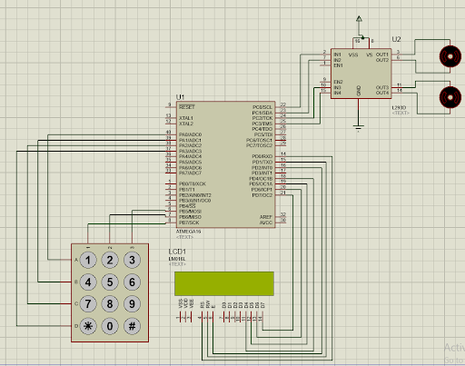

<pre
class="prettyprint">/*
 * P9_keyPad_Motor_LCD.c
 *
 * Created: 25-03-2021 17:19:38
 * Author : Jervis
 */ 

#define F_CPU 1000000UL
#include &lt;avr/io.h>
#include &lt;string.h>
#include &lt;util/delay.h>

#define lcd PORTD

lcd_init()
{

lcd_cmd(0x02);
	lcd_cmd(0x28);

lcd_cmd(0x0c);
}
lcd_cmd(int x)
{

lcd=(x&0xf0)+0x04;
	_delay_ms(2);
	lcd=lcd-0x04;

lcd=((x&lt;&lt;4)&0xf0)+0x04;
	_delay_ms(2);

lcd=lcd-0x04;
}
lcd_data(int x)
{

lcd=(x&0xf0)+0x05;
	_delay_ms(2);
	lcd=lcd-0x04;

lcd=((x&lt;&lt;4)&0xf0)+0x05;
	_delay_ms(2);

lcd=lcd-0x04;
}
string_data(char *str){

int i = 0;

for(i=0; i&lt;=strlen(str) ; i++){

lcd_data(str[i]);
		_delay_ms(8);
		lcd_cmd(0x06);

}
}
char arr[11] = "0123456789";
number_data(int number){

int i;
	if(number>0)
	{
		i=number%10;

number=number/10;
		
		number_data(number);

lcd_data(arr[i]);
		lcd_cmd(0x06);
		_delay_ms(10);

}
}

int key()
{

while (1) {

PORTB = 0b11011111; _delay_ms(20);
		

if (PINA == 0xfe) { while (PINA == 0xfe); return  1;}

	

if (PINA == 0xfd) { while (PINA == 0xfd); return  4;}

	

if (PINA == 0xfb) { while (PINA == 0xfb); return  7;}

	

if (PINA == 0xf7) { while (PINA == 0xf7); return 10;}

	
		PORTB = 0b10111111; _delay_ms(20);

if (PINA == 0xfe) { while (PINA == 0xfe); return  2;}

	

if (PINA== 0xfd) { while (PINA == 0xfd); return  5;}

	

if (PINA == 0xfb) { while (PINA == 0xfb); return  8;}

	

if (PINA == 0xf7) { while (PINA == 0xf7); return 11;}

	
		PORTB = 0b01111111; _delay_ms(30);

if (PINA == 0xfe) { while (PINA == 0xfe); return  3;}

	

if (PINA == 0xfd) { while (PINA == 0xfd); return  6;}

	

if (PINA == 0xfb) { while (PINA == 0xfb); return  9;}

	

if (PINA == 0xf7) { while (PINA == 0xf7); return 12;}

} 
}

int main(void)
{
    DDRC = DDRB = DDRD = 0xff;
    DDRA = 0xf0;
    PORTA = 0xff;

int n[5] = {2,8,4,6,0};

lcd_init();
    while (1) 
    {

	int button = key();

lcd_cmd(0x01); _delay_ms(10);

lcd_cmd(0x83); _delay_ms(100);
		number_data(button);

if (button == n[0])
		{

PORTC = 0b00001001;
			lcd_cmd(0xc3);

string_data(" Forward");

}else if (button== n[1])
		{

PORTC = 0b00000110;
			lcd_cmd(0xc3);

string_data(" Backward");

}else if (button == n[2])
		{

PORTC = 0b00000001;
			lcd_cmd(0xc3);

string_data(" Left");

}else if (button == n[3])
		{

PORTC = 0b00001000;
			lcd_cmd(0xc3);

string_data(" Right");
		}else
		{

PORTC = 0b00000000;
			lcd_cmd(0xc3);

string_data(" Stop");
		}

    }
}</pre>
<h4>P10: INTERFACING OF DOT MATRIX
DISPLAY (DMD)  WITH ATMEGA16 ( CUSTOM CHARACTER “T”)</h4>

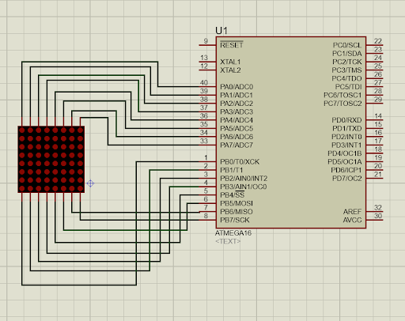

<pre
class="prettyprint">/*
 * P10_DMD_Display.c
 *
 * Created: 25-03-2021 21:51:10
 * Author : Jervis
 */ 
#define F_CPU 1000000UL
#include &lt;avr/io.h>
#include &lt;util/delay.h>

int main(void)
{

DDRA = DDRB = 0xff;
	

while (1)
	{
		PORTA = 0x7e;

PORTB= 0xfe;
		_delay_ms(100);

PORTA = 0x18;
		PORTB = 0x00;

_delay_ms(100);
	}
}</pre>
<h4>P11: INTERFACING OF IRSensor, DC
Motor And Motor Driver L293D  WITH ATMEGA16</h4>

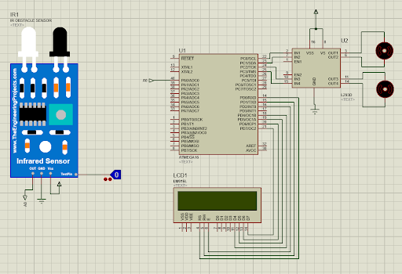

<pre
class="prettyprint">/*
 * P11_IR_Sensor_DC_Motors.c
 *
 * Created: 26-03-2021 19:22:28
 * Author : Jervis
 */ 

#define F_CPU 1000000UL
#include &lt;avr/io.h>
#include &lt;string.h>
#include &lt;util/delay.h>

#define lcd PORTD

lcd_init()
{

lcd_cmd(0x02);
	lcd_cmd(0x28);

lcd_cmd(0x0c);
}

lcd_cmd(int x)
{

lcd=(x&0xf0)+0x04;
	_delay_ms(2);
	lcd=lcd-0x04;

lcd=((x&lt;&lt;4)&0xf0)+0x04;
	_delay_ms(2);

lcd=lcd-0x04;
}

lcd_data(int x)
{

lcd=(x&0xf0)+0x05;
	_delay_ms(2);
	lcd=lcd-0x04;

lcd=((x&lt;&lt;4)&0xf0)+0x05;
	_delay_ms(2);

lcd=lcd-0x04;
}
string_data(char *str){

int i = 0;

for(i=0; i&lt;=strlen(str) ; i++){

lcd_data(str[i]);
		_delay_ms(8);
		lcd_cmd(0x06);

}
}

char arr[11] = "0123456789";
number_data(int number){

int i;
	if(number>0)
	{
		i=number%10;

number=number/10;
		
		number_data(number);

lcd_data(arr[i]);
		lcd_cmd(0x06);
		_delay_ms(10);

}
}

int main(void)
{

DDRC = DDRD = 0xff;
	DDRA = 0xff;

	lcd_init();
	while(1){
	

lcd_cmd(0x83);
	string_data("..Object..");
	

while(PINA == 0x01)
	{

PORTC = 0x00;
		lcd_cmd(0x01);

lcd_data(0xc0);
		string_data("Detected Stoping");

_delay_ms(100);
		
		PORTC = 0x06;

lcd_cmd(0x01);
		lcd_data(0xc3);

string_data(" Backward ");
		_delay_ms(1000);

		PORTC = 0x08;
		lcd_cmd(0x01);

lcd_data(0xc3);
		string_data("Right");

_delay_ms(1000);
		lcd_cmd(0x01);
		_delay_ms(10);
	}

	
	PORTC = 0x09;
	lcd_cmd(0xc3);

string_data(" Forward ");
	}
}</pre>
<h4>Project 1 : Line Follower Car
Simulation in Proteus  WITH ATMEGA16, Two IRSensors and MotorDriver IC
L293D:</h4>

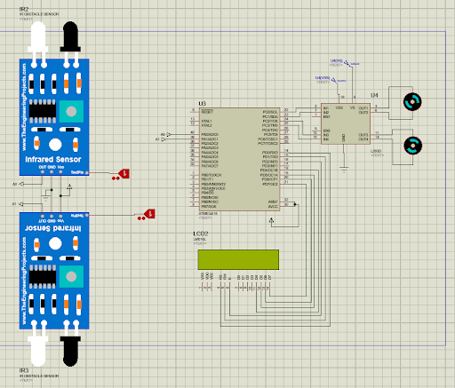

<pre
class="prettyprint">/*
 * P11_LineFollower_v1.c
 *
 * Created: 26-03-2021 21:14:11
 * Author : Jervis
 */ 

#define F_CPU 1000000UL
#include &lt;avr/io.h>
#include &lt;string.h>
#include &lt;util/delay.h>
#define lcd PORTD

lcd_init()
{

lcd_cmd(0x02);
	lcd_cmd(0x28);

lcd_cmd(0x0c);
}

lcd_cmd(int x)
{

lcd=(x&0xf0)+0x04;
	_delay_ms(2);
	lcd=lcd-0x04;

lcd=((x&lt;&lt;4)&0xf0)+0x04;
	_delay_ms(2);

lcd=lcd-0x04;
}

lcd_data(int x)
{

lcd=(x&0xf0)+0x05;
	_delay_ms(2);
	lcd=lcd-0x04;

lcd=((x&lt;&lt;4)&0xf0)+0x05;
	_delay_ms(2);

lcd=lcd-0x04;
}
string_data(char *str){

int i = 0;

for(i=0; i&lt;=strlen(str) ; i++){

lcd_data(str[i]);
		_delay_ms(8);
		lcd_cmd(0x06);

}
}

char arr[11] = "0123456789";
number_data(int number){

int i;
	if(number>0)
	{
		i=number%10;

number=number/10;
		
		number_data(number);

lcd_data(arr[i]);
		lcd_cmd(0x06);
		_delay_ms(10);

}
}

int main(void)
{

DDRC = DDRD = 0xff;
	DDRA = 0xfe;

	lcd_init();
	
	lcd_cmd(0x01);

lcd_cmd(0x81);
	string_data("LINE FOLLOWER");
	

while(1)
	{
		if (PINA == 0b00000011)

{
			PORTC = 0x09;
			lcd_cmd(0x01);

lcd_data(0xc1);
			string_data("F");

// _delay_ms(10);

}else if (PINA == 0b00000010)
		{

PORTC = 0x01;
			lcd_cmd(0x01);

lcd_data(0xc1);
			string_data(" L ");

// _delay_ms(10);

}else if (PINA == 0b00000001)
		{

PORTC = 0x08;
			lcd_cmd(0x01);

lcd_data(0xc1);
			string_data(" R ");

// _delay_ms(10);

}else if (PINA == 0b00000000)
		{

PORTC = 0x00;
			lcd_cmd(0x01);

lcd_data(0xc3);
			string_data(" S ");

// _delay_ms(10);
		}

	}	

}</pre>

